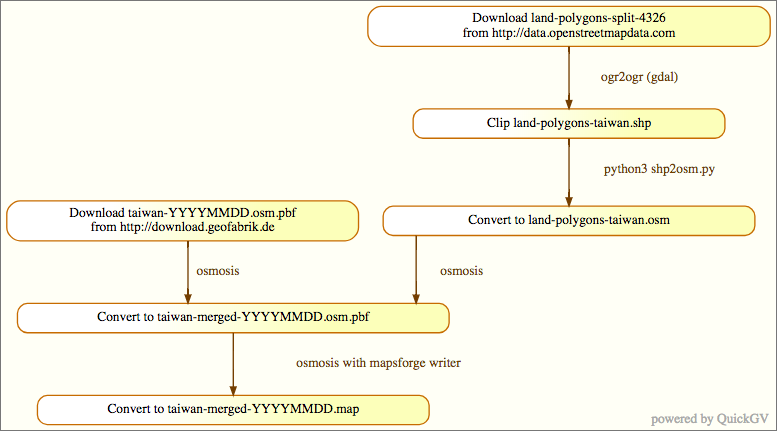

# sync-osmtw
Docker container to sync Taiwan subset of latest OSM.



# Howto
First execution.
```sh
$ mkdir ~/osm-data
$ docker-compose up
```

If 'mapsforge-writer/Dockerfile' was modified, build image before execute.
```sh
$ docker-compose build
```

# Version of key packages
Package | Version
---- | ----
Osmosis | 0.45
GDAL | 2.2.3
Mapsforge Writer | 0.8.0
